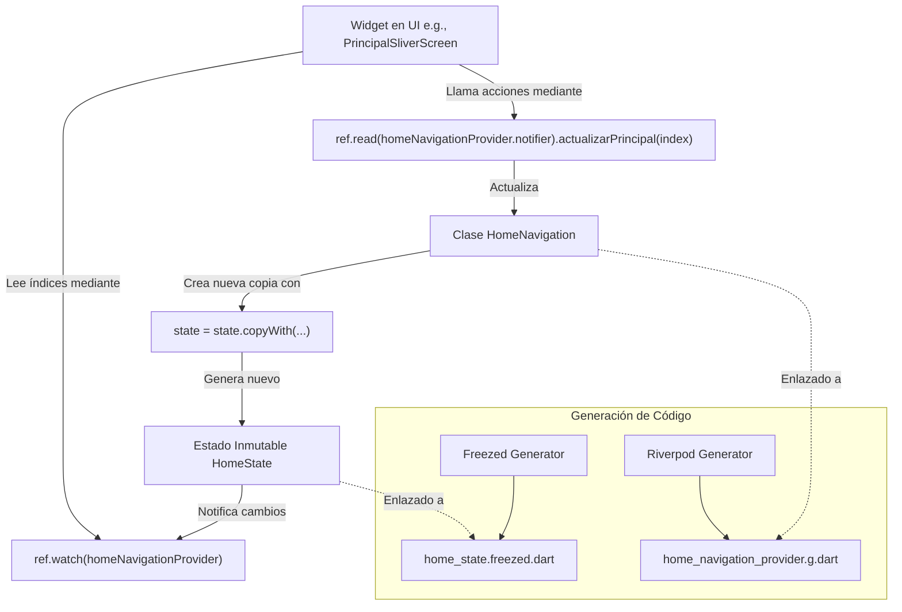

# Inventario de Componentes: `lib/01_home`

Este documento contiene un inventario técnico detallado de cada uno de los archivos del directorio `D:\buscobien\lib\01_home`, el cual gestiona la persistencia y la reactividad del estado de navegación principal de la aplicación Buscobien.

## Tabla de Inventario de Componentes

| Subdirectorio (si aplica) | Nombre del archivo | Tipo de componentes | Nombre del componente | Parámetros que requiere (en su caso) | Variables que utiliza | Variables internas | Estilos que le aplican (en su caso) |
| :--- | :--- | :--- | :--- | :--- | :--- | :--- | :--- |
| **N/A** (Raíz de `lib/01_home`) | `home_state.dart` | Clase de Modelo de Estado (Freezed) | `HomeState` | **Constructor de fábrica `HomeState`** (todos opcionales con valores por defecto `@Default(0)`):<br>- `int indiceInicial`<br>- `int indicePrincipal`<br>- `int indiceNivelGobierno`<br>- `int indiceTipoEspacio`<br>- `int indiceTipoTransaccion`<br>- `int indiceMiCuenta`<br>- `int indiceMiCuentaUsuario`<br>- `int version` | - Importa `@freezed` de `freezed_annotation`. | **Propiedades/Getters inmutables de estado:**<br>- `indiceInicial`<br>- `indicePrincipal`<br>- `indiceNivelGobierno`<br>- `indiceTipoEspacio`<br>- `indiceTipoTransaccion`<br>- `indiceMiCuenta`<br>- `indiceMiCuentaUsuario`<br>- `version` | *No aplica* (Es un archivo de definición de estructura de datos inmutables y no visual). |
| **N/A** (Raíz de `lib/01_home`) | `home_navigation_provider.dart` | Clase / Gestor de Estado (Riverpod Notifier) | `HomeNavigation` | **Método `build()`**:<br>- Ninguno (retorna un `HomeState` inicial con `indiceInicial: 0`).<br><br>**Métodos modificadores de estado**:<br>- `setInicial(int i)`<br>- `setPrincipal(int i)`<br>- `setGobierno(int i)`<br>- `setEspacio(int i)`<br>- `setTransaccion(int i)`<br>- `setMiCuenta(int i)`<br>- `setMiCuentaUsuario(int i)`<br><br>**Métodos con impresión de depuración detallada (logs)**:<br>- `actualizarInicial(int index)`<br>- `actualizarPrincipal(int index)`<br>- `actualizarNivelGobierno(int index)`<br>- `actualizarTipoEspacio(int index)`<br>- `actualizarTipoTransaccion(int index)`<br>- `actualizarMiCuenta(int index)`<br>- `actualizarMiCuentaUsuario(int index)` | - Modelo de estado `HomeState` (`home_state.dart`).<br>- Función `debugPrintLevels` de `lib/60_global_widgets/debugprint.dart`. | - `state` (variable de estado heredada de Riverpod de tipo `HomeState` sobre la cual se hace la actualización reactiva mediante `state.copyWith(...)`). | *No aplica* (Es lógica de negocio pura y persistencia de navegación; no tiene representación visual). |
| **N/A** (Raíz de `lib/01_home`) | `home_state.freezed.dart` | Código Generado (Freezed) | - Mixin `_$HomeState`<br>- Clase `_HomeState`<br>- Copiadores `_$HomeStateCopyWith`, `_$_HomeStateCopyWith` | *Autogenerado por `build_runner`*.<br>Soporta la instanciación e interfaces de copia profunda de `HomeState`. | - Dependencias de `freezed_annotation`. | - Métodos autogenerados de utilidades de datos: `copyWith`, `toString`, `operator ==`, `hashCode`. | *No aplica* (Código autogenerado para soporte del modelo). |
| **N/A** (Raíz de `lib/01_home`) | `home_navigation_provider.g.dart` | Código Generado (Riverpod Generator) | - Proveedor global `homeNavigationProvider`<br>- Clase `HomeNavigationProvider`<br>- Clase abstracta `_$HomeNavigation` | *Autogenerado por `build_runner`*.<br>Permite que la UI acceda a la navegación mediante `ref.watch(homeNavigationProvider)` y mutar estado con `ref.read(homeNavigationProvider.notifier)`. | - Depende de `HomeNavigation` y `HomeState`.<br>- Importa `riverpod_annotation`. | - Hash de depuración `_$homeNavigationHash`.<br>- Métodos `create`, `runBuild` y `overrideWithValue`. | *No aplica* (Código autogenerado para la inyección de dependencias de Riverpod). |

---

## Análisis de Arquitectura y Flujo de Trabajo en `01_home`

### 1. Propósito de este Módulo
Este módulo es el **núcleo de control de navegación** de Buscobien. En lugar de usar un sistema de rutas de navegación imperativo clásico (`Navigator.push` / `go_router`) para cada pequeña pestaña o filtro, la aplicación utiliza una arquitectura basada en **gestión de estado reactivo**. 

El estado (`HomeState`) almacena los índices seleccionados en los distintos niveles de menús y submenús del sistema:
- **`indiceInicial`**: Controla el flujo o la pantalla principal activa del menú inicial (por ejemplo, Inicio, Mi Cuenta, etc.).
- **`indicePrincipal`**: Controla el submenú de opciones de búsqueda o categorías principales.
- **`indiceNivelGobierno`**: Registra el nivel de gobierno filtrado (Federal, Estatal, Municipal).
- **`indiceTipoEspacio`**: Registra el tipo de espacio físico seleccionado (e.g. Oficinas, Parques, etc.).
- **`indiceTipoTransaccion`**: Registra si el espacio está en renta, venta, donación, etc.
- **`indiceMiCuenta`**: Controla las opciones seleccionadas dentro de la pestaña "Mi Cuenta" del usuario o promotor.
- **`indiceMiCuentaUsuario`**: Controla sub-pestañas adicionales de perfil y configuración.
- **`version`**: Un entero incremental autoadministrado que se incrementa en cada llamada a `actualizar...()`, forzando a los widgets que escuchan el estado a redibujarse de manera garantizada y consistente.

### 2. Cómo interactúan estos componentes (Flujo de Datos)



1. **La UI de Flutter (e.g., Menús de Inicio, Sliver Screens)** observa el estado de navegación utilizando:
   ```dart
   final homeNav = ref.watch(homeNavigationProvider);
   final indexActivo = homeNav.indiceInicial;
   ```
2. **Cuando el usuario hace clic** en una pestaña, la UI despacha un cambio de estado:
   ```dart
   ref.read(homeNavigationProvider.notifier).actualizarInicial(nuevoIndex);
   ```
3. El notifier `HomeNavigation` recibe la llamada, escribe en consola la traza de depuración usando `debugPrintLevels` si el nivel de log está habilitado, y actualiza `state` con una copia inmutable del estado (`state.copyWith`) incrementando además la propiedad `version` para asegurar reactividad total.
4. **Riverpod propaga de inmediato** el nuevo estado a todos los Widgets que observan `homeNavigationProvider`, actualizando la interfaz de forma ultra-eficiente y sincronizada.
