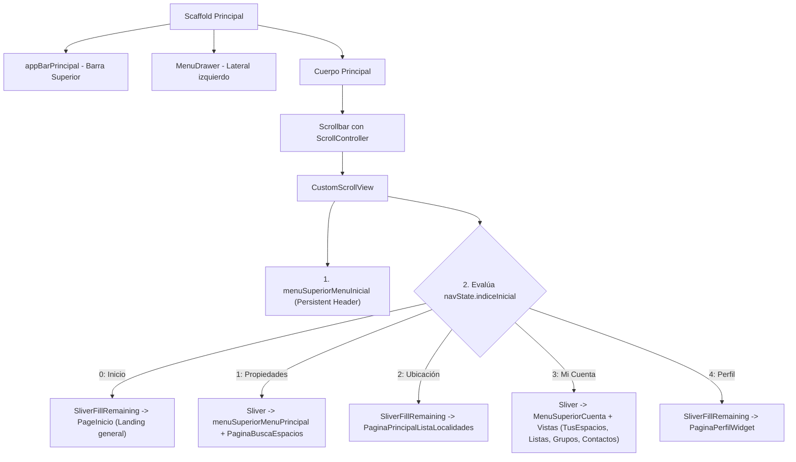

# Inventario de Componentes: `lib/02_principal_screen`

Este documento contiene un inventario técnico completo de cada uno de los archivos del directorio `D:\buscobien\lib\02_principal_screen`, el cual funge como el **esquema principal de visualización (Layout Engine)** de la aplicación Buscobien. Este módulo compone la pantalla principal, integra la barra de navegación superior (AppBar), la barra lateral (Drawer) y ensambla de manera dinámica el contenido con base en Slivers.

## Tabla de Inventario de Componentes

| Subdirectorio (si aplica) | Nombre del archivo | Tipo de componentes | Nombre del componente | Parámetros que requiere (en su caso) | Variables que utiliza | Variables internas | Estilos que le aplican (en su caso) |
| :--- | :--- | :--- | :--- | :--- | :--- | :--- | :--- |
| **N/A** (Raíz de `lib/02_principal_screen`) | `00_principales_opciones.dart` | Variable Global / Colección de Widgets | `listaLandingPages` | *No aplica* | - Mapea y almacena los widgets de páginas importados de `lib/03_vistas/` (`LandingBusquedaPage`, `LandingAgentesPage`, etc.). | - Lista ordenada de instancias de páginas de aterrizaje. | *No aplica* (Estructura de enrutamiento). |
| **N/A** (Raíz de `lib/02_principal_screen`) | `00_principales_opciones.dart` | Clase / Modelo de Datos Local | `MenuOption` | **Constructor constante `const MenuOption`** con parámetros nombrados requeridos: - `required String nombreCorto` - `required String nombreLargo` - `required String descripcion` - `required IconData icono` - `required String imagePath` | *Ninguna* | **Campos inmutables de instancia:** - `nombreCorto` (`String`)  - `nombreLargo` (`String`)  - `descripcion` (`String`)  - `icono` (`IconData`)  - `imagePath` (`String`) | *No aplica* (Definición de modelo). |
| **N/A** (Raíz de `lib/02_principal_screen`) | `00_principales_opciones.dart` | Variable Global / Colección de Datos | `menuOpciones` | *No aplica* | - Instancia múltiples objetos de `MenuOption`.  - Usa constantes de iconos de `var_elementos_menus.dart`. | - Lista de objetos con información descriptiva de perfiles e imágenes de fondo correspondientes. | *No aplica* (Modelo y estructura de datos). |
| **N/A** (Raíz de `lib/02_principal_screen`) | `principal_00_inicio.dart` | StateProviders de Riverpod | `codigoPostalBusquedaProvider` `warningApp` | *No aplica* | - `StateProvider` simple para persistir enteros o booleanos reactivamente. | - Valores primitivos de tipo `int?` y `bool?`. | *No aplica*. |
| **N/A** (Raíz de `lib/02_principal_screen`) | `principal_00_inicio.dart` | Widget con Estado Reactivo (`ConsumerStatefulWidget`) | `PageInicio` / `PageInicioState` | **Constructor estándar:** - `const PageInicio({super.key})` | - Tema visual `appTheme`.  - Colecciones `menuOpciones` y `listaLandingPages`.  - Variables globales de diseño `screenWidth` y `smallScreenMin`.  - Footer `derechosReservadosClaro()`. | - `ScrollController _scrollController` (para efectos de desplazamiento).  - `String backgroundImage` (imagen hero adaptativa). | **Diseño de Impacto Visual:** - Fondo estilo Hero con `BoxFit.cover` y capa gradiente de oscurecimiento (`LinearGradient` de negro con opacidades `0.85` a `0.90`). - Tipografías premium: `'Outfit'` (para títulos principales, peso extra negrita y sombras de texto `Shadow`) y `'Plus Jakarta Sans'` (para subtítulos). - Rejilla adaptativa Wrap con espaciado de tarjetas (`spacing: 20`, `runSpacing: 25`). - Tarjetas de servicio `customCardServicios` y `customCardSmallServicios` con sombras pronunciadas (`BoxShadow` con desenfoque de 15), bordes redondeados (`BorderRadius.circular(12)`) y micro-animación al tacto o cursor. |
| **N/A** (Raíz de `lib/02_principal_screen`) | `principal_00_inicio.dart` | Widget con Estado Auxiliar (`StatefulWidget` / Animador) | `_HoverScaleCard` / `_HoverScaleCardState` | **Constructor obligatorio:** - `required Widget child` - `required VoidCallback onTap` | *Ninguna* | - `AnimationController _controller` (para la escala en hover). | **Animaciones de Interacción:** - Modifica el cursor a modo click (`SystemMouseCursors.click`). - Escala sutilmente el widget hijo a un tamaño máximo de `1.04` (4% de aumento) al hacer hover o presionar usando `AnimatedBuilder` y `Transform.scale`. |
| **N/A** (Raíz de `lib/02_principal_screen`) | `principal_02_page_appbar.dart` | Función de construcción de UI (Helper Widget Builder) | `appBarPrincipal` | **Parámetros obligatorios:** - `BuildContext context` - `VoidCallback onTab` - `String titulo` - `WidgetRef ref` | - Providers de conectividad, ubicación y sesión (`checaConeccionesProvider`, `ubicacionActualProvider`, `sessionProvider`, `classUserAvatarProvider`, etc.). - Rutas `AppRoutes` y diálogos como `dialogBoxFichaLogin`. - Variables globales de toolbar y temas. | - `double screenWidth` (ancho de pantalla). - `String idUsuario` y `String nombreUsuario` (datos del usuario logueado). - `List<Widget> listaBotones` (lista de acciones activas). | **Barra de Navegación Premium:** - Altura de barra configurada mediante `menuToolbarHeight`. - Color de fondo usando `appTheme.onInverseSurface`. - Botones interactivos que reflejan la conectividad mediante semáforos de color (`appTheme.primary` conectado / `appTheme.error` desconectado). - Icono de usuario dinámico que dibuja un `CircleAvatar` redondo con la imagen cargada en base64 o icono de marcador de Material si no hay sesión. |
| **N/A** (Raíz de `lib/02_principal_screen`) | `principal_03_page_drawer.dart` | Widget sin Estado Reactivo (`ConsumerWidget`) | `MenuDrawer` | **Constructor estándar:** - `const MenuDrawer({super.key})` | - `versionActual` (de `versiones.dart`). - Diálogo global `showMessageDialog()`. - `AppRoutes` para navegación lateral. | *Ninguna* | **Panel Lateral Deslizable:** - Ancho estático configurado en `250` píxeles. - Fondo en `appTheme.surface`. - Separadores estéticos `Divider` con color `appTheme.secondary` y sangrías delimitadas (`indent: 14`, `endIndent: 30`). - Cabecera `DrawerHeader` de altura fija (`100.0`) con color primario, conteniendo un logo asimétrico y el nombre de la app estilizado con fuente `'Comfortaa'`. |
| **N/A** (Raíz de `lib/02_principal_screen`) | `principal_sliver_screen_menus_inicio.dart` | Widget con Estado Reactivo (`ConsumerStatefulWidget`) | `PrincipalSliversMenuInicial` / `_PrincipalSliversMenuInicialState` | **Constructor estándar:** - `const PrincipalSliversMenuInicial({super.key})` | - Escucha una gama completa de providers de Riverpod (menús, navegación global `homeNavigationProvider`, conectividad y ubicación). - Diálogos de autenticación y vistas correspondientes a cada opción seleccionada del menú inicial y de cuenta. | - `ScrollController _scrollController` (controlador de scroll global para el `CustomScrollView`). - Banderas de control de peticiones (`_locationRequested`, `_isErrorPageOpen`). - Variables de dimensiones. | **Arquitectura de Ensamblado en Slivers:** - Contenedor basado en `CustomScrollView` que permite un desplazamiento uniforme de barras de herramientas anidadas. - Integración del menú superior persistente `menuSuperiorMenuInicial`. - Inyección reactiva y condicional de pantallas completas mediante `SliverFillRemaining` con scroll dinámico (`hasScrollBody: true` / `false`). - Botones de invitación a inicio de sesión (`_vistaSinUsuario`) en formato de tarjetas de ancho máximo `500` con bordes redondeados y contorno sólido primario. |
| **N/A** (Raíz de `lib/02_principal_screen`) | `principal_sliver_screen_menus_inicio.dart` | Widget sin Estado (`StatelessWidget`) | `VistaContenidoDinamico` | **Constructor obligatorio:** - `required HomeState navState` | - Widget `PaginaBuscaEspacios` para la renderización de la parrilla de búsqueda. | *Ninguna* | - Renderiza de manera dinámica la pantalla de búsqueda de espacios o un contenedor vacío invisible (`SizedBox.shrink`). |

---

## Análisis de Arquitectura y Flujo de Trabajo en `02_principal_screen`

### 1. El Motor de Layout Híbrido (Slivers)
El archivo [principal_sliver_screen_menus_inicio.dart](file:///D:/buscobien/lib/02_principal_screen/principal_sliver_screen_menus_inicio.dart) implementa la estructura central de la interfaz de la aplicación mediante una arquitectura basada en **Slivers**. 

En lugar de utilizar un diseño rígido con columnas estáticas, se optó por un `CustomScrollView`. Esto ofrece dos ventajas cruciales para la experiencia de usuario (UX):
* **Desplazamiento unificado y elástico**: Tanto los menús superiores como el contenido dinámico de las páginas de búsqueda, listas o chats se desplazan bajo el mismo scroll físico, evitando "scrolls anidados" conflictivos que rompen la fluidez en dispositivos móviles y web.
* **Carga diferida (Sliver Lazy Loading)**: Los elementos fuera de la pantalla no se dibujan ni consumen memoria sino hasta que el usuario se desplaza hacia ellos.

### 2. Micro-animaciones y Wow Factor (Aesthetics)
Una de las claves del diseño premium de este módulo es la clase de animación `_HoverScaleCard` implementada en [principal_00_inicio.dart](file:///D:/buscobien/lib/02_principal_screen/principal_00_inicio.dart). 

Cuando el usuario navega a través de las opciones en una pantalla de escritorio o móvil, las tarjetas reaccionan de manera instantánea y orgánica:
* Al pasar el ratón (hover) o al tocar la tarjeta, se inicia un `AnimationController` con una curva de desaceleración suave de 150 milisegundos que escala la tarjeta un 4%.
* El cursor del sistema cambia a "click" (`SystemMouseCursors.click`), invitando a la acción.
* Esto, combinado con el fondo translúcido sobre imágenes hero de alta calidad y fuentes elegantes como `'Outfit'` y `'Comfortaa'`, elimina la sensación de un aplicativo estático o simple, otorgando una sensación de interactividad premium y sofisticación técnica.
