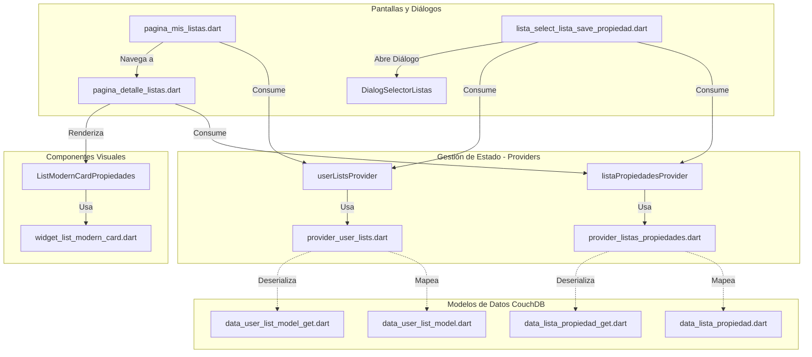

# Inventario de Componentes - Módulo de Listas (`lib/03_listas`)

Este documento presenta un análisis y desglose completo del módulo de **Listas de Favoritos** (`lib/03_listas`) de la aplicación **Buscobien**. Este módulo administra la creación de carpetas personalizadas de los usuarios y la asignación de propiedades (inmuebles) dentro de dichas carpetas, interactuando con el backend CouchDB en tiempo real a través de Riverpod y solicitudes HTTP REST.

---

## Estructura de Archivos en `lib/03_listas`

El módulo se compone de **10 archivos Dart** organizados en modelos de datos de entrada/salida (Lectura/Escritura), controladores de estado (Providers de Riverpod) e interfaces de usuario reactivas.

---

## Tabla General del Inventario de Componentes

La siguiente tabla resume detalladamente cada componente identificado en los archivos del directorio `D:\buscobien\lib\03_listas` con las columnas requeridas:

| Subdirectorio | Nombre del Archivo | Tipo de Componente | Nombre del Componente | Parámetros que Requiere | Variables que Utiliza / Inyecta | Variables Internas | Estilos que le Aplican |
| :--- | :--- | :--- | :--- | :--- | :--- | :--- | :--- |
| `03_listas` | `data_lista_propiedad.dart` | Modelo de Datos (Escritura) | `ListaPropertyListModel` | `listapropiedad` | N/A (Métodos de mapeo toMap / toJson) | `listapropiedad` (tipo `Listapropiedad`) | N/A (Es lógico de datos) |
| `03_listas` | `data_lista_propiedad.dart` | Entidad de Datos | `Listapropiedad` | `listapropiedadId`, `userId`, `listaId`, `propertyId`, `tipodeespacio`, `type`, `timestamp` | N/A | `listapropiedadId` (String), `userId` (String), `listaId` (String), `propertyId` (String), `tipodeespacio` (String), `type` (String), `timestamp` (String) | N/A |
| `03_listas` | `data_lista_propiedad_get.dart` | Modelo de Datos (Lectura / CouchDB View) | `GetListaPropertyListModel` | `totalRows`, `offset`, `rows` | N/A | `totalRows` (int), `offset` (int), `rows` (List<RowListaProperty>) | N/A |
| `03_listas` | `data_lista_propiedad_get.dart` | Fila del Listado | `RowListaProperty` | `id`, `key`, `listapropiedad` | N/A | `id` (String), `key` (dynamic), `listapropiedad` (Listapropiedad) | N/A |
| `03_listas` | `data_user_list_model.dart` | Modelo de Datos (Escritura) | `UserPropertyListModel` | `lista` | N/A | `lista` (tipo `Lista`) | N/A |
| `03_listas` | `data_user_list_model.dart` | Entidad de Datos | `Lista` | `listaId`, `userId`, `listName`, `type`, `timestamp` | N/A | `listaId` (String), `userId` (String), `listName` (String), `type` (String), `timestamp` (String) | N/A |
| `03_listas` | `data_user_list_model_get.dart` | Modelo de Datos (Lectura / CouchDB View) | `GetUserPropertyListModel` | `totalRows`, `offset`, `rows` | N/A | `totalRows` (int), `offset` (int), `rows` (List<RowGetUserPropertyList>) | N/A |
| `03_listas` | `data_user_list_model_get.dart` | Fila de la Lista | `RowGetUserPropertyList` | `id`, `key`, `value` | N/A | `id` (String), `key` (String), `value` (Lista) | N/A |
| `03_listas` | `lista_select_lista_save_propiedad.dart` | `ConsumerStatefulWidget` | `DialogSelectorListas` | `propiedad` (tipo `ValueEspaciosCasaGet`) | `sessionProvider`, `userListsProvider`, `listaPropiedadesProvider` | `_idUsuario` (String), `_listIdsWithProperty` (List<String>) | `appTheme.primary`, `appTheme.onPrimary`, `appTheme.secondary`, `appTheme.onSecondary`, `appTheme.onPrimaryContainer`, `appTheme.error`, `appTheme.onError` |
| `03_listas` | `lista_select_lista_save_propiedad.dart` | Diálogo Emergente Auxiliar | `_mostrarDialogoCrearLista` | Contexto de Flutter y Notifier de Riverpod | `userListsProvider` | `txtController` (TextEditingController) | Diálogo con estilo de color `appTheme.primary` y fondo `onSecondary`, tipografía `"Comfortaa"` y redondeo de esquinas de `6.0` |
| `03_listas` | `pagina_detalle_listas.dart` | `ConsumerStatefulWidget` | `PageDetalleLista` | `lista` (tipo `Lista`) | `listaPropiedadesProvider`, `espaciosCasaConListaFotosGetProvider`, `endpointsPublicados` | `_initialLoadFuture` (Future<int>), `propertyId` (String), `listapropiedadId` (String), `rowListProperty` (RowListaProperty) | `appTheme.onInverseSurface` (Scaffold background), `appTheme.primary` (AppBar, textos generales), `appTheme.onPrimary` (iconos y botones), `appTheme.error` (botón e indicador de borrado) |
| `03_listas` | `pagina_mis_listas.dart` | `ConsumerStatefulWidget` | `PageMisListas` | N/A (Inicializado por el enrutador) | `sessionProvider`, `userListsProvider` | `_idUsuario` (String) | `appTheme.primary`, `appTheme.onPrimary`, `appTheme.secondary` en FloatingActionButton y tarjetas de listados |
| `03_listas` | `pagina_mis_listas.dart` | Diálogo Emergente de UI | `_mostrarDialogoCrearLista` | N/A | `userListsProvider` | `txtController` (TextEditingController) | `AlertDialog` con bordes redondeados (`6`), fuente `"Comfortaa"`, color `appTheme.primary` y `onSecondary` |
| `03_listas` | `pagina_mis_listas.dart` | Componente de UI Alterno | `_vistaInvitado` | N/A | `iconoUsuario.icono`, `appTheme` | N/A | Botón de acceso de invitado decorado con bordes de color `appTheme.primary` y texto `"Outfit"` |
| `03_listas` | `provider_listas_propiedades.dart` | Gestor de Estado (Riverpod Notifier) | `listaPropiedadesProvider` | N/A (Instancia global) | `direccionip`, `username`, `password` (Seguridad/Conectividad) | `_uuid` (Uuid para generación de IDs locales), `_headers` (Calculado para Auth básica) | N/A |
| `03_listas` | `provider_user_lists.dart` | Gestor de Estado (Riverpod Notifier) | `userListsProvider` | N/A (Instancia global) | `direccionip`, `username`, `password` | N/A | N/A |
| `03_listas` | `provider_user_lists.dart` | `FutureProvider.family` | `propertiesDetailsProvider` | `ids` (List<String>) | `direccionip`, `username`, `password` | N/A | N/A |
| `03_listas` | `widget_list_modern_card.dart` | `ConsumerWidget` | `ListModernCardPropiedades` | `itemCasa` (tipo `EspaciosCasa`) | `widthCuadroFotoPropiedad`, `heightCuadroFotoPropiedad`, `appTheme`, `PaginaCarouselFotosUsuario` | Constantes estáticas: `iconSizeBanner`, `textSizeBanner`, `espacioEntreDato`, `valoresString` | Tarjeta moderna con sombreado de elevación `6.0`, esquinas redondeadas (`12.0`), textos formateados dinámicamente con `appTheme.onPrimaryContainer` |

---

## Análisis Técnico y Flujo de Operación por Archivo

### 1. `data_lista_propiedad.dart` y `data_lista_propiedad_get.dart`
Estos archivos forman la estructura de datos que representa los ítems individuales guardados en una lista. En CouchDB, la relación **Muchos a Muchos** entre *Usuarios-Listas* y *Propiedades* se almacena en una base de datos intermedia denominada `buscobien_listas_propiedades`.
- `data_lista_propiedad.dart` se encarga de serializar los datos cuando el usuario agrega una propiedad a una lista (método POST).
- `data_lista_propiedad_get.dart` procesa los resultados obtenidos de la vista CouchDB `DDLOCAL/vistaListaID` que filtra las duplas mediante la clave `listaId`.

### 2. `data_user_list_model.dart` y `data_user_list_model_get.dart`
Representan el catálogo de carpetas personalizadas que posee un usuario (ej. "Casas Bosque", "Departamentos Renta").
- Se almacenan en la base de datos `buscobien_usuarios_listas`.
- Tienen un atributo `listName` de hasta 60 caracteres y un identificador único `listaId` generado localmente mediante SHA1 + valores aleatorios para evitar colisiones.

### 3. `lista_select_lista_save_propiedad.dart`
Contiene el widget visual `DialogSelectorListas`. Este componente se dispara cuando un usuario presiona el botón "Guardar en Favoritos/Lista" desde cualquier tarjeta de propiedad.
- **Flujo**:
  1. Identifica al usuario activo mediante `sessionProvider`.
  2. Consulta la lista de carpetas disponibles mediante `userListsProvider`.
  3. Muestra una lista interactiva con checkboxes indicando si la propiedad ya pertenece a cada carpeta.
  4. Permite crear una nueva lista sobre la marcha (`_mostrarDialogoCrearLista`) sin salir del flujo de guardado.
  5. Al hacer clic, invoca a `listaPropiedadesProvider.notifier.addPropiedadALista` o `borrarPropiedadDeLista` según corresponda para actualizar CouchDB.

### 4. `pagina_detalle_listas.dart`
Muestra el desglose de inmuebles guardados en una lista particular.
- Utiliza un `ListView.separated` para renderizar tarjetas de propiedades de forma lineal.
- Implementa la directiva `Dismissible` para que el usuario pueda deslizar hacia la izquierda y remover propiedades de forma fluida.
- Cuenta con un diálogo emergente de confirmación antes de la eliminación real.
- Obtiene los datos detallados de cada propiedad usando un `FutureBuilder` secundario que invoca a `espaciosCasaConListaFotosGetProvider.notifier.getPropiedadCasaIdPropiedad` dinámicamente basándose en el ID de la relación guardada.

### 5. `pagina_mis_listas.dart`
Es la pestaña o pantalla principal encargada de agrupar todas las carpetas favoritas del usuario.
- Si el usuario no ha iniciado sesión, renderiza la `_vistaInvitado` que lo invita a loguearse mediante el diálogo `dialogBoxFichaLogin`.
- Si está logueado, consulta `userListsProvider` para listar las carpetas disponibles en formato de tarjetas de diseño moderno.
- Incluye un `FloatingActionButton` de creación rápida que abre el diálogo `_mostrarDialogoCrearLista`.
- Permite hacer clic en cualquier tarjeta para abrir `PageDetalleLista` o borrar la carpeta entera mediante el icono de papelera.

### 6. `provider_listas_propiedades.dart` y `provider_user_lists.dart`
Son las clases controladoras de Riverpod que encapsulan todas las peticiones http y la persistencia de estado local.
- **Mecanismo de Sincronización Local**: Cuando se borra o agrega un elemento con éxito en el backend CouchDB, el provider no requiere una recarga completa de red. En su lugar, actualiza directamente su variable local `state` con una copia filtrada de las filas, garantizando una UI instantánea y de alta respuesta (micro-animación visual).

### 7. `widget_list_modern_card.dart`
Contiene el widget optimizado `ListModernCardPropiedades`, responsable de dibujar la ficha del inmueble guardado con el diseño estandarizado del sistema:
- Soporta carrusel de imágenes adaptativo a través de `PaginaCarouselFotosUsuario`.
- Utiliza la paleta `appTheme` para adaptarse a temas dinámicos.
- Mapea de forma inteligente los iconos de características (baños, recámaras, metros cuadrados, etc.), ocultándolos automáticamente si sus valores son `"0"` o vacíos.

---

## Verificación de Aplicación de Estilos y Directrices de Diseño

El análisis de estos archivos confirma que el módulo de listas sigue rigurosamente las pautas de arquitectura establecidas en el proyecto:
1. **No hay hardcoding de colores**: Todo elemento visual se enlaza directamente a `appTheme` (ej. `appTheme.primary`, `appTheme.onInverseSurface`, `appTheme.error`).
2. **Fuentes tipográficas consistentes**: Se aplican consistentemente fuentes de la familia `"Comfortaa"` para elementos amigables/diálogos y `"Outfit"` para encabezados de sección.
3. **Optimización de renderizado**: Componentes pesados (como la tarjeta de propiedad) heredan de `ConsumerWidget` en lugar de `StatefulWidget` para evitar llamadas redundantes de rebuild y se encapsulan llamadas pesadas de renderizado mediante métodos helper especializados.
