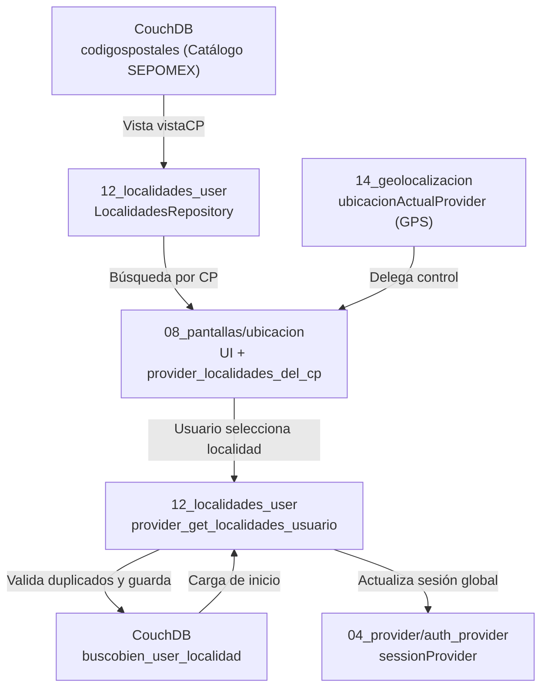

# Reporte de Arquitectura: Módulos de Localización y Ubicación
**Proyecto:** BuscoBien — Flutter / Riverpod / CouchDB  
**Fecha:** 2026-05-23  
**Módulos principales:**
- `lib/12_localidades_user/` — Gestión de localidades del usuario y repositorio
- `lib/08_pantallas/ubicacion/` — Pantallas, providers de búsqueda y visualización

---

## 1. Visión General de la Arquitectura

El sistema de localización de BuscoBien opera a través de un flujo centralizado, utilizando Riverpod para el estado reactivo, Freezed para la inmutabilidad de los datos, y CouchDB como base de datos documental.

---

## 2. Módulo `12_localidades_user` — Gestión y Repositorio

### 2.1 Propósito
Maneja las localidades guardadas por los usuarios y encapsula la comunicación con CouchDB tanto para las ubicaciones del usuario como para el catálogo SEPOMEX.

### 2.2 Inventario Principal
- **Modelos (Freezed):** `UsuarioLocalidades`, `UsuarioLocalidadesGet`, `RowsUserLocal`.
- **Repositorio:** `LocalidadesRepository` — Centraliza llamadas HTTP (`fetchUserLocalidades`, `fetchUserLocalid`, `saveUserLocalidad`, `fetchByCodigoPostal`).
- **Provider:** `ClassUserLocalNotifierProvider` — Notifier principal que gestiona la lista de localidades y sincroniza con el `sessionProvider`.

### 2.3 Aspectos Clave
- **Inmutabilidad:** Uso exhaustivo de `@freezed` para evitar mutaciones no intencionadas.
- **Prevención de duplicados:** `LocalidadesRepository.saveUserLocalidad` consulta `vistaUserAsentamiento` de CouchDB antes de persistir, evitando duplicidades en base de datos al devolver un HTTP 409.
- **Sincronización:** Al seleccionar una localidad, el Notifier actualiza el `sessionProvider` para propagar la ubicación a filtros globales de búsqueda.

---

## 3. Módulo `08_pantallas/ubicacion/` — UI e Integración de Mapas

### 3.1 Propósito
Provee las interfaces visuales para que el usuario busque códigos postales, visualice localidades, interactúe con Google Maps y gestione sus ubicaciones preferidas.

### 3.2 Componentes Clave
- **UI de Búsqueda:** `PaginaBuscaLocalidadGMaps` (integra `GoogleMap` y delega control al `ubicacionActualProvider`).
- **UI de Listado:** `LocalidadesListScreen` (maestro de localidades de un CP) y `PaginaPrincipalListaLocalidades` (ubicaciones guardadas).
- **Modelos:** `LocalidadCp`, `LocalidadesGet` (Modelos Freezed compartidos para mapear respuestas SEPOMEX).
- **Providers:** `provider_localidades_del_cp` (gestiona solicitudes de CP y lista resultante).

### 3.3 Aspectos Clave
- **Integración de Mapas:** Delega la gestión geográfica nativa al provider central de geolocalización.
- **Diseño visual:** Estricto uso de las variables de `appTheme` para consistencia UI en todos los widgets.
