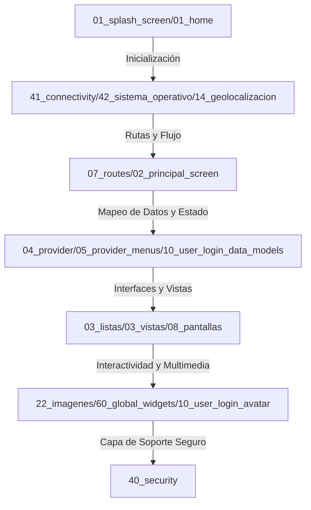

# Resumen Ejecutivo: Arquitectura de Módulos de Buscobien

Este documento provee un compendio de alto nivel de los puntos destacados, responsabilidades y fortalezas técnicas de cada uno de los módulos que han sido exhaustivamente inventariados en el proyecto **Buscobien**.

La arquitectura de la aplicación está dividida en capas lógicas que van desde la inicialización y manejo de estado reactivo global hasta la capa de interfaz, utilidades multimedia, enrutamiento y seguridad.

---

---

## 1. Capa de Inicialización y Flujo de Arranque

- **`01_home`** ([ver inventario](file:///D:/buscobien/_inventario_componentes/inventario_01_home.md)):
  - **Responsabilidad**: Punto de entrada inicial de la aplicación.
  - **Destacados**: Actúa como un enrutador inteligente inicial en el arranque del hilo principal, desviando de manera directa al usuario hacia la pantalla de bienvenida o el panel principal dependiendo de su estado de autenticación.
- **`01_splash_screen`** ([ver inventario](file:///D:/buscobien/_inventario_componentes/inventario_01_splash_screen.md)):
  - **Responsabilidad**: Ciclo de calentamiento (_warm-up_) de la app.
  - **Destacados**: Controla el despliegue del branding corporativo mientras orquesta de forma asíncrona las tareas críticas en segundo plano: verificación de conectividad y geolocalización satelital de coordenadas GPS.

---

## 2. Capa de Estructura de Navegación e Interfaces Principales

- **`02_principal_screen`** ([ver inventario](file:///D:/buscobien/_inventario_componentes/inventario_02_principal_screen.md)):
  - **Responsabilidad**: Layout unificado de la aplicación móvil y web.
  - **Destacados**: Integra un contenedor elástico con barra de búsqueda flotante, menús deslizables (_Slivers_), un mapa reactivo en segundo plano y transiciones de exclusión mutua para desplegar los listados de inmuebles.
- **`03_listas`** ([ver inventario](file:///D:/buscobien/_inventario_componentes/inventario_03_listas.md)):
  - **Responsabilidad**: Organización de catálogos y resultados inmobiliarios.
  - **Destacados**: Modela la presentación de propiedades categorizadas (en venta, renta, remates).
- **`03_vistas`** ([ver inventario](file:///D:/buscobien/_inventario_componentes/inventario_03_vistas.md)):
  - **Responsabilidad**: Tarjetas de presentación y renders.
  - **Destacados**: Administra los widgets y bloques visuales de los inmuebles, unificando la tipografía y los bordes redondeados según guías premium de Material Design 3.
- **`07_routes`** ([ver inventario](file:///D:/buscobien/_inventario_componentes/inventario_07_routes.md)):
  - **Responsabilidad**: Mapa de ruteo del proyecto.
  - **Destacados**: Centraliza la definición de rutas nombradas (`AppRoutes`) de forma estricta, coordinando el paso de parámetros fuertemente tipados entre vistas de forma segura.

---

## 3. Capa de Manejo de Estado y Providers (Riverpod)

- **`04_provider`** ([ver inventario](file:///D:/buscobien/_inventario_componentes/inventario_04_provider.md)):
  - **Responsabilidad**: El motor reactivo de negocio.
  - **Destacados**: Define y expone los proveedores clave de Riverpod para gestionar datos de sesión del usuario, histórico de búsquedas, filtros aplicados a los inmuebles y parámetros globales del sistema.
- **`05_provider_menus`** ([ver inventario](file:///D:/buscobien/_inventario_componentes/inventario_05_provider_menus.md)):
  - **Responsabilidad**: Coordinación táctil de la UI.
  - **Destacados**: Controla de forma reactiva los índices activos de las barras de navegación inferiores, menús laterales deslizantes y estados de colapso de paneles interactivos de filtros.

---

## 4. Capa de Vistas de Usuario y Especializadas (`08_pantallas`)

- **`08_pantallas_inicio`** ([ver inventario](file:///D:/buscobien/_inventario_componentes/inventario_08_pantallas_inicio.md)):
  - **Responsabilidad**: Listados y banners de novedades.
  - **Destacados**: Construye la página principal para el usuario final con listados asíncronos y recomendados.
- **`08_pantallas_perfil`** ([ver inventario](file:///D:/buscobien/_inventario_componentes/inventario_08_pantallas_perfil.md)):
  - **Responsabilidad**: Gestión de datos y roles de la cuenta.
  - **Destacados**: Permite actualizar información, administrar suscripciones y alternar configuraciones de cuenta (p. ej., activar rol de Promotor).
- **`08_pantallas_propiedades`** ([ver inventario](file:///D:/buscobien/_inventario_componentes/inventario_08_pantallas_propiedades.md)):
  - **Responsabilidad**: Detalle exhaustivo del inmueble.
  - **Destacados**: Pantalla enfocada a desplegar características de la casa (recámaras, baños, metros cuadrados, precio, descripción) y botones de contacto integrados.
- **`08_pantallas_tu_cuenta`** ([ver inventario](file:///D:/buscobien/_inventario_componentes/inventario_08_pantallas_tu_cuenta.md)):
  - **Responsabilidad**: Espacio interactivo de autogestión.
  - **Destacados**: Modula el perfil de usuario del promotor, administrando accesos directos hacia "Tus Espacios" (crear y editar inmuebles) y "Mis Grupos".
- **`08_pantallas_ubicacion`** ([ver inventario](file:///D:/buscobien/_inventario_componentes/inventario_08_pantallas_ubicacion.md)):
  - **Responsabilidad**: Selector de mapas interactivo.
  - **Destacados**: Permite al usuario designar un punto en el mapa de forma manual mediante arrastre de marcador de coordenadas satelitales.
- **`08_pantallas_widgets_comunes`** ([ver inventario](file:///D:/buscobien/_inventario_componentes/inventario_08_pantallas_widgets_comunes.md)):
  - **Responsabilidad**: Bloques transversales de visualización.
  - **Destacados**: Agrupa loaders unificados, dividers de marca y contenedores de tarjetas.

---

## 5. Capa de Autenticación, Datos de Login y Personalización (`10_user_login`)

- **`10_user_login_avatar`** ([ver inventario](file:///D:/buscobien/_inventario_componentes/inventario_10_user_login_avatar.md)):
  - **Responsabilidad**: Identidad visual del perfil de usuario.
  - **Destacados**: Implementa una cuadrícula dinámica interactiva para elegir avatares preestablecidos en formato SVG u optimizar fotos en Base64 para guardarlas de forma compacta en CouchDB.
- **`10_user_login_data_models`** ([ver inventario](file:///D:/buscobien/_inventario_componentes/inventario_10_user_login_data_models.md)):
  - **Responsabilidad**: Serialización estricta de cuentas.
  - **Destacados**: Define estructuras inmutables de parseo de datos de usuario con métodos robustos `fromJson` y `toMap`, asegurando consistencia de roles y banderas.
- **`10_user_login_usuario_login`** ([ver inventario](file:///D:/buscobien/_inventario_componentes/inventario_10_user_login_usuario_login.md)):
  - **Responsabilidad**: Seguridad de acceso a la cuenta.
  - **Destacados**: Agrupa las interfaces interactivas de login, registro de cuentas e interfaces de recuperación de contraseña con validación de expresiones regulares.

---

## 6. Capa de Geoposicionamiento e Integración Satelital

- **`12_localidades_user`** ([ver inventario](file:///D:/buscobien/_inventario_componentes/inventario_12_localidades_user.md)):
  - **Responsabilidad**: Gestión de zonas preferentes de búsqueda.
  - **Destacados**: Mapea estados, municipios y asentamientos urbanos permitiendo filtrar inmuebles con precisión de zona geográfica.
- **`14_geolocalizacion`** ([ver inventario](file:///D:/buscobien/_inventario_componentes/inventario_14_geolocalizacion.md)):
  - **Responsabilidad**: Localizador satelital del dispositivo.
  - **Destacados**: Administra permisos del GPS local (con `geolocator`), resolviendo coordenadas físicas latitud/longitud y mapeándolas asíncronamente con nombres de colonias y calles para centrar la búsqueda.

---

## 7. Capa Multimedia y Visor de Fotos del Inmueble (`22_imagenes`)

- **`22_imagenes`** ([ver inventario](file:///D:/buscobien/_inventario_componentes/inventario_22_imagenes.md)):
  - **Responsabilidad**: Orquestador principal multimedia.
  - **Destacados**: Proporciona las constantes y configuraciones generales del módulo de fotografía de las propiedades.
- **`22_imagenes_data_models`** ([ver inventario](file:///D:/buscobien/_inventario_componentes/inventario_22_imagenes_data_models.md)):
  - **Responsabilidad**: Modelos serializadores de CouchDB de imágenes.
  - **Destacados**: Modela la transferencia binaria asíncrona de archivos multimedia pesados (Base64) y el guardado secuencial del orden de fotos personalizado por el promotor.
- **`22_imagenes_inicio_fotos_usuario`** ([ver inventario](file:///D:/buscobien/_inventario_componentes/inventario_22_imagenes_inicio_fotos_usuario.md)):
  - **Responsabilidad**: Slider interactivo de visualización.
  - **Destacados**: Emplea carruseles dinámicos (`CarouselSlider`) en dos sabores: tamaño extendido con opciones de guardado de listas, y tamaño miniatura optimizado para no recargar la memoria de las tarjetas compactas de resultados.
- **`22_imagenes_tus_espacios_fotos_propiedad`** ([ver inventario](file:///D:/buscobien/_inventario_componentes/inventario_22_imagenes_tus_espacios_fotos_propiedad.md)):
  - **Responsabilidad**: Motor de compresión adaptativo.
  - **Destacados**: Implementa compresión asíncrona por canales nativos en móvil y conmuta a algoritmos escritos en Dart puro en Windows/Web para evadir fallas, manejando metadatos clonados con `PlatformFileNoFinal`.

---

## 8. Capa Base de Configuración Global, Conectividad y Soporte de Hardware

- **`20_var_globales`** ([ver inventario](file:///D:/buscobien/_inventario_componentes/inventario_20_var_globales.md)):
  - **Responsabilidad**: Centralizador de constantes y tokens.
  - **Destacados**: Declara la paleta armónica premium de `appTheme` unificada para Material Design 3, dimensiones dimensionales de diseño responsivo y cadenas textuales compartidas.
- **`40_security`** ([ver inventario](file:///D:/buscobien/_inventario_componentes/inventario_40_security.md)):
  - **Responsabilidad**: Seguridad criptográfica e inyección de secretos.
  - **Destacados**: Provee hashing de contraseñas (SHA-256) e inyección pasiva de secretos de CouchDB mediante variables de compilación (`String.fromEnvironment`), protegiendo las credenciales del servidor.
- **`41_connectivity`** ([ver inventario](file:///D:/buscobien/_inventario_componentes/inventario_41_connectivity.md)):
  - **Responsabilidad**: Resiliencia y monitoreo de red.
  - **Destacados**: Utiliza `AsyncNotifierProvider` de Riverpod para monitorear en tiempo real el estado de conectividad e incluye un detector con auto-descarte que quita la pantalla de bloqueo en cuanto vuelve la conexión a internet.
- **`42_sistema_operativo`** ([ver inventario](file:///D:/buscobien/_inventario_componentes/inventario_42_sistema_operativo.md)):
  - **Responsabilidad**: Detección segura del entorno.
  - **Destacados**: Emplea constantes abstractas (`kIsWeb`, `defaultTargetPlatform`) para identificar de forma segura el sistema operativo, previniendo excepciones de compilación física en el navegador.
- **`60_global_widgets`** ([ver inventario](file:///D:/buscobien/_inventario_componentes/inventario_60_global_widgets.md)):
  - **Responsabilidad**: Biblioteca transversal de inputs y elementos interactivos.
  - **Destacados**: Agrupa campos de contraseña interactivos, diálogos modales tipados con retorno del enum `DialogAction`, firmas elegantes de copyright, loaders e implementaciones robustas de formateo monetario con comas de millar.
